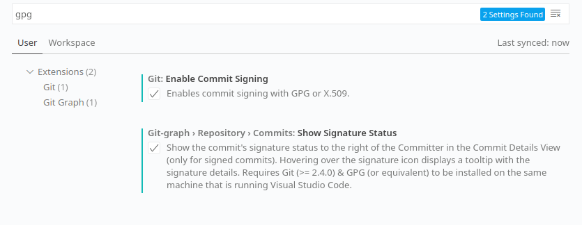

GPG keys can be used to sign commits to a git repository.[^gitlab] This verifies the identity of a committer so other people can trust that the changes come from a trusted source.[^github]

[^gitlab]: [Signing commits with GPG in GitLab](https://docs.gitlab.com/ee/user/project/repository/gpg_signed_commits/)
[^github]: [Managing commit signature verification in GitHub](https://docs.github.com/en/free-pro-team@latest/github/authenticating-to-github/managing-commit-signature-verification)

## GPG Setup

### Create key

To create a key use `gpg --full-gen-key`. [Here]() you find a more thorough explanation how to create a master keys, subkeys and how to revoke them.


### Public Key

Export the public key with `gpg --armor --export john.doe@example.org > public.key`. The content of this file is the public key. Open the file and copy the key to paste it to GitHub and GitLab.

## GitLab

Upload the public key to GitLab. Go to `Settings -> GPG Keys` and paste the public key into the box and confirm with clicking on `Add key`.

## GitHub

Upload the public key to GitHub.  Go to `Settings -> SSH and GPG keys` and click on `New GPG key`. Then paste the public key and confirm with clicking on `Add GPG key`.

## Git Configuration

Since the private and public subkeys are already in the keyring, the Git configuration is quite easy. To get the ID of the signing key use

```sh
gpg --list-signatures
```

And with the following command Git knows which key to use for signing a commit

```sh
git config --global user.signingkey <alphanumeric-key-id>
```

To sign a commit the flag `-s` is required

```sh
git commit -s -m "Commit message"
```

To avoid this additional flag and sign commits per default just edit the Git configuration

```sh
git config --global commit.gpgsign true
```

With the `--global` flag these settings will be applied for all repositories. If these settings should be applied to the current repository only just omit the `--global` flag in the commands above. 

## VS Code Configuration

Enabling signed commits in VS Code is straightforward. To append the `-s` flag to the `git commit` command just search for `gpg` in the settings and enable `Enables commit signing with GPG` by checking the box. I also enable `Show the commit's signature status...` so that I can see the signature details in a tooltip.



Another possibility is to edit the `settings.json`. Just add the following setting:

```json
"git.enableCommitSigning": true,
"git-graph.repository.commits.showSignatureStatus": true
```

The last one is optional and just for showing the signature details for a commit in git graph.

## Error

If the following error occurs:

```sh
error: gpg failed to sign the data
fatal: failed to write commit object
```

Then [add](http://manpages.ubuntu.com/manpages/focal/man1/gpg-agent.1.html)

```sh
GPG_TTY=$(tty)
export GPG_TTY
```

to the `.bashrc`. 