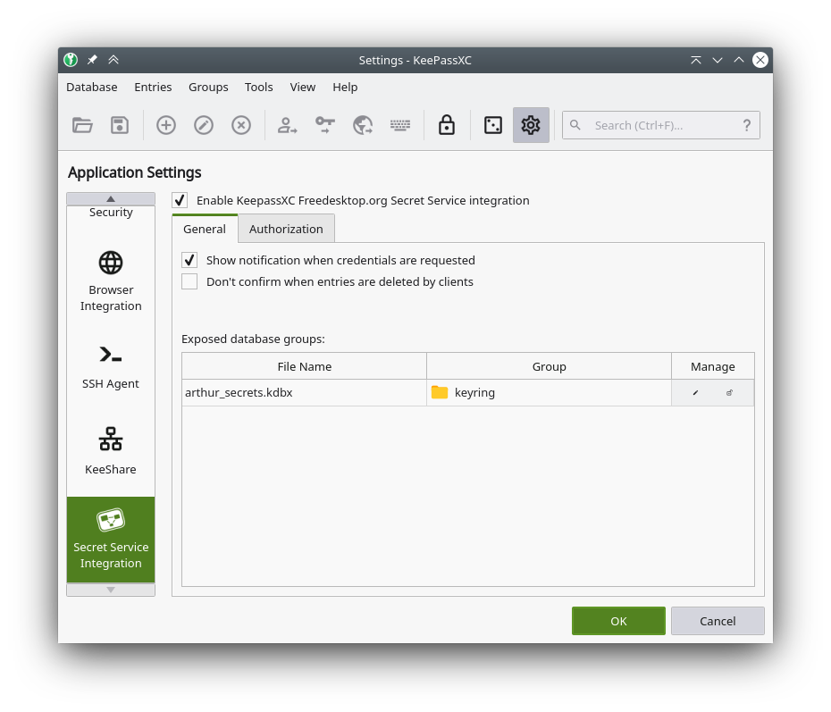
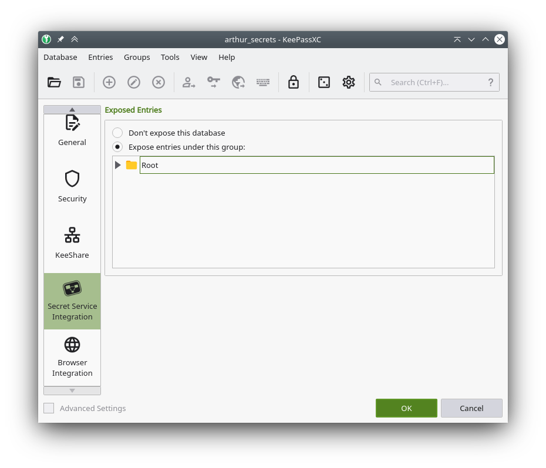

## Problem

After installing [Visual Studio Code](https://code.visualstudio.com/) in [KDE Neon](https://neon.kde.org/) and trying to [sync my settings](https://code.visualstudio.com/docs/editor/settings-sync) with the onboard sync feature I got the following error message:

> "No such interface "org.freedesktop.Secret.Collection" on object at path /org/freedesktop/secrets/collection/login"

After using my favorite search engine the problem could be [identified](https://code.visualstudio.com/docs/editor/settings-sync#_troubleshooting-keychain-issues). The generated token couldn't be written to the keychain since `gnome-keyring` is not pre-installed in KDE Neon. Additionally, VS Code and `KWallet` do not work well together. 

## Solution

The [simplest solution](https://github.com/microsoft/vscode/issues/92972#issuecomment-625751232) is to install `gnome-keyring`. Though its installation is relatively lightweight even on a KDE-only desktop I don't like to install GNOME stuff and at the same time I don't like KWallet. 

After some more usage of my favorite search engine I found the [solution](https://www.cogitri.dev/posts/03-keepassxc-freedesktop-secret/) that fits best to my setup. Using the password manager [KeePassXC](https://keepassxc.org/) - which I am already using - as system keyring in KDE Neon.

The setup is fairly simple. The first step is to enable the `Secret Service Integration` in KeePassXC. This can be done by activating `Enable KeePassXC Freedesktop.org Secret Service Integration` in `Tools > Settings > Secret Service Integration`.

The second step is to change a database setting so that the entries are exposed via the secret service integration. For this open `Database > Database Settings... > Secret Service Integration`. By enabling `Expose entries under this group:` you can choose which groups should be exposed. I decided to create a separate group for the integration and only this group is exposed via the integration. You can see this in the first screenshot.

## Result

Now the error message from Visual Studio Code disappeared and the token is stored in KeePassXC now. The sync works now.

As [Rasmus Thomsen](https://www.cogitri.dev/posts/03-keepassxc-freedesktop-secret/) already noted in his blog there are some advantages and disadvantages.

Advantages:

- Single source of truth.
- The database is not unlocked automatically after login. 

The latter point is listed by Rasmus Thomsen as drawback, but in my opinion this is just an inconvenience that actually improves security. Therefore, this point is listed here as advantage.

Disadvantage:

- No pop-up dialog to unlock the database when an application requests secrets using the freedesktop API.