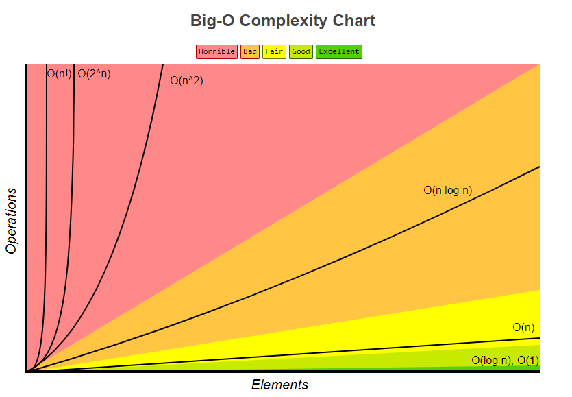

 
The goal is to find the computational complexity of an algorithm – the amount of time (_time complexity_), storage (_space complexity_), or other resources needed to execute them.  This helps us to identify better and worse algorithms.

An algorithm is said to be efficient when this function's values are small. or grow slowly compared to  a growth in the size of the input.

> **Asymptotic Notation in a few words:**
>
> Suppress constant factors and lower-order terms.

The constant factors are too system-dependent and the lower-order terms are irrelevant for large inputs. 

## Big-O  Notation

The Big-O notation is a mathematical notation that describes the behavior of a function/algorithm when the argument tends toward infinity. 

The formal definition of big-O notation:

> %$T(n)=O(f(n))%$ if and only if there exist positive constants %$c%$ and %$n_0%$ such that
>
> $$ T(n) \leq c \cdot f(n) $$
>
> for all %$n \geq n_0%$.

This inequality tells us that %$T(n)%$ should be bounded by a multiple of %$f(n)%$. The last part, the for all %$n \geq n_0%$, says that the inequality holds for sufficient large %$n%$. The constant %$n_0%$ defines sufficient large. 

The image shows curve progressions for some typical big-O values.

### Infinite Asymptotics

Big-o notation is useful when analyzing algorithms for efficiency. That's the way we use big-O here.

### Infinitesimal Asymptotics

Big-O can also be used to describe the error term in an approximation to a mathematical function. The most significant terms are written explicitly, and then the leas significant terms are summarized in a single big-O term:

$$ 
\begin{aligned}
e^x &= 1 + x + \frac{x^2}{2!} + \frac{x^3}{3!} + \frac{x^4}{4!} + ... \\\\
&= 1 + x + O(x^2)
\end{aligned}
$$

### Properties

**Product**

$$ f_1 = O(g_1) \text{ and } f_2 = O(g_2) \Rightarrow f_1 f_2 = O(g_1 g_2) $$

**Sum**

$$ f_1 = O(g_1) \text{ and } f_2 = O(g_2) \Rightarrow f_1 + f_2 = O(max(g_1,g_2)) $$

**Multiplication by a constant**

$$ O(|k|g) = O(g) \text{ if k is non-zero} $$
$$ f = O(g) \Rightarrow kf = O(g) $$

## Big-Omega Notation

A function %$T(n)%$ is big-omega of another function %$f(n)%$ if and only if %$T(n)%$ is eventually bounded below by a constant multiple of %$f(n)%$. We write then %$T(n)=\Omega(f(n))%$

> %$T(n)=\Omega(f(n))%$ if and only if there exist positive constants %$c%$ and %$n_0%$ such that
>
> $$ T(n) \geq c \cdot f(n) $$
>
> for all %$n \geq n_0%$.

## Big-Theta Notation

%$T(n) = \Theta(fn)%$ just means %$T(n) = \Omega(fn)%$ _and_ %$T(n) = O(fn)%$. 

> %$T(n)=\Theta(f(n))%$ if and only if there exist positive constants %$c_1,c_2%$ and %$n_0%$ such that
>
> $$ c_1 \cdot f(n) \leq T(n) \leq c_2 \cdot f(n) $$
>
> for all %$n \geq n_0%$.

## Little-O Notation

The little-o notation is more strict than the big-o notation since %$T(n)=o(f(n))%$ must hold for every positive constant %$c%$.

> %$T(n)=o(f(n))%$ if and only if for every positive constant %$c>0%$, there exists a choice of %$n_0%$ such that
>
> $$ T(n) \leq c \cdot f(n) $$
>
> for all %$n \geq n_0%$.

Little-o notation makes a stronger statement than the corresponding big-O notation: 

> * Every function that is little-o of f is also big-O of f. 
> * Not every function that is big-O of f is also little-o of f.

## Little-Omega Notation

Little-omega is more strict than the big-omega notation since %$T(n)=\omega(f(n))%$ must hold for every positive constant %$c%$.

> %$T(n)=\omega(f(n))%$ if and only if for every positive constant %$c>0%$, there exists a choice of %$n_0%$ such that
>
> $$ T(n) \geq c \cdot f(n) $$
>
> for all %$n \geq n_0%$.