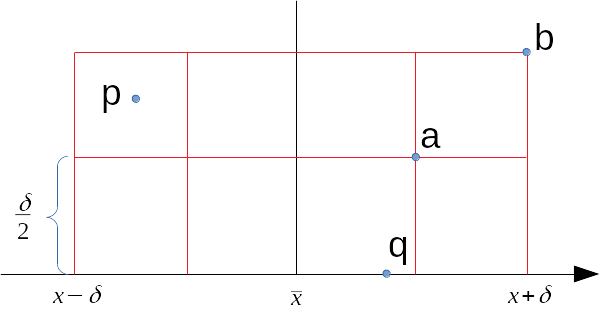

 
This divide and conquer algorithm is an algorithm to solve the **closest pair** problem. In this problem %$n%$ points in the plane are given and we have to find the pair of points that are closest to each other.

> **Closest Pair Problem**
>
> **Input:** %$n \geq 2 %$ points %$p_1 = (x_1,y_1),...,p_n = (x_n,y_n)%$ in the plane.
>
> **Result:** Pair of points with smallest Euclidian distance %$d(p_i,p_j)%$

This is an application in the field of **computational geometry**, an area that studies algorithms for reasoning about and manipulating geometric objects, and that has applications in robotics, computer vision, and computer graphics[^tim].

[^tim]: Tim Roughgarden (2017). Algorithms Illuminated: Part1 The Basics. Soundlikeyourself Publishing, ISBN: 978-0999282908

## Example

The image shows an example of the closest pair problem. The task is to find the two points with the lowest distance to each other.


In this tiny example the closest pair of points are shown in red.

## Explanation

The Euclidian distance[^sqrt] can be used to measure the straight-line distance between two points %$p_1 = (x_1,y_1)%$ and %$p_2 = (x_2,y_2)%$: 

$$d(p_1,p_2) = \sqrt{(x_1 - x_2)^2 + (y_1 - y_2)^2}$$ 

[^sqrt]: In real world applications the computation of the square root is not required; the result will be the same.

The **brute-force method** can be used to find these two points. Just compute the Euclidian distance between each pair of points one-by-one. Since this is very time consuming, we can do better with a **divide and conquer algorithm**.

The calculation of the **closest step** starts with the **preprocessing step** and makes copies of the points and sorts them with a time complexity of %$O(n \log n)%$:

- A copy of the points %$P_x%$ sorted by %$x%$-coordinates.
- A copy of the points %$P_y%$ sorted by %$y%$-coordinates.

The next step computes the closest pair for each side. For this %$P_x%$ will be divided into two halves %$L%$ and %$R%$, this can be implemented in %$O(n)%$ time:

- Then %$L_x%$, the first half of %$P_x%$ sorted by %$x%$-coordinate will be derived
    - Just split %$P_x%$ in half since this is already sorted
- Then %$L_y%$, the first half of %$P_x%$ sorted by %$y%$-coordinate will be derived
    - Algorithm can perform a linear scan over %$P_y%$ putting each point at the end of %$L_y%$
- Then %$R_x%$, the second half of %$P_x%$ sorted by %$x%$-coordinate will be derived
- Then %$R_y%$, the second half of %$P_x%$ sorted by %$y%$-coordinate will be derived

The next step are the recursive calls to get closest pair for each side:

- Get the **closest pair** %$(l_1,l_2)%$ for %$L_x%$ and %$L_y%$
- Get the **closest pair** %$(r_1,r_2)%$ for %$R_x%$ and %$R_y%$
- Calculate %$\delta%$ the minimum of the distance between the closest pair that is left or right

But we need more since the case of split pairs has to be covered. Split pairs are given when both points are not on the same side. The computation of the **closest split pair** can be done in %$O(n)%$. The idea is to do a brute force search over a restricted set of point pairs.

- Hand over the value %$\delta%$ explicitly to the function that calculates the closest split pair
- Then use the brute force method to compare all points that are in the range %$\bar{x} \pm \delta%$ and return %$(s_1,s_2)%$ 
    - %$\bar{x}%$ is the x-coordinate of the rightmost point in the left half - %$O(1)%$
    - Sort the points by y-coordinates - %$O(n)%$
    - Total number of loop iterations is less than %$7 \times%$ the number of points between %$\bar{x} \pm \delta \Rightarrow O(n)%$     

Finally return the best of %$(l_1,l_2)%$, %$(r_1,r_2)%$ and %$(s_1,s_2)%$ 

The base case is given with two or three points; then the brute force method is applied.

### Correctness of the Divide and Conquer Strategy

The following guarantees that when the closest pair is split pair, its points appear in the filtered set %$S_y%$.

> In the subroutine to find the closest split pair, we suppose %$(p,q)%$ is a split pair with %$d(p,q) < \delta%$, where %$\delta%$ is the smallest distance between a left air or right pair of points, Then:
>
> (1) %$p%$ and %$q%$ will be included in the set %$S_y%$
>
> (2) at most six points of %$S_y%$ have a y-coordinate in between those of %$p%$ and %$q%$

The above-mentioned statements ensures that if the closest pair is a split pair, the subroutine that finds them returns it. This is because %$p%$ and %$q%$ belong to the same set %$S_y%$ and there are at most six points between them in y-coordinate. The algorithm searches over all pairs of points that satisfy these two properties and will compute the closest pair, which must be %$(p,q)%$.

We also know that for every set %$P%$ with two or more points in the plane, the algorithm that finds the closest pair computes the closest pair of %$P%$ and runs in %$O(n \log n)%$ time. The running time is dominated by the preprocessing step and runs in %$O(n \log n)%$ time, while the rest of this algorithm has the same asymptotic running time as [merge sort]().

To _proof the first of the two statements_ above, we assume that there is a split pair %$(p,q)%$, with %$p%$ in the left half, %$q%$ in the right half of the point set and %$d(p,q)<\delta%$. We can write the following equation:

$$
\begin{aligned}
\delta &> d(p,q) \\\\
       &= \sqrt{(x_1-x_2)^2+(y_1-y_2)^2} \\\\
       &\geq \sqrt{\text{max}\left[(x_1-x_2)^2,(y_1-y_2)^2\right]} \\\\
       &= \text{max}\left[(x_1-x_2)^2,(y_1-y_2)^2\right]
\end{aligned}
$$
 
We can conclude that the difference between %$p%$ and %$q%$ is less than %$\delta%$ in their x- and y-coordinates:

$$ |x_1-x_2|,|y_1-y_2| < \delta $$

We can make now the following statements to proof:

$$ x_1 \leq \bar{x} \land x_1 + \delta \leq x_2 \Rightarrow x_2 \leq \bar{x} + \delta $$

$$ x_2 \geq \bar{x} \land x_2 - \delta \geq x_1 \Rightarrow x_1 \geq \bar{x} - \delta $$

Now we _proof the second of the two statements_. For this we draw eight boxes in the plane in a 2x4 pattern around %$\bar{x}%$, where each box has side length %$\delta/2%$. The bottom of the boxes is aligned with the lower of the points %$p%$ and %$q%$.



The eight boxes contain not more than eight points, including %$p%$ and %$q%$. So there can be just 6 points in between %$p%$ and %$q%$ ion y-coordinate. Therefore we have to make up to 7 calculations in the brute force part of the closest split pair part of the algorithm. 

But what would happen if there are two points in one box? This would led to a contradiction. In the image the points %$a%$ and %$b%$ are in one box farthest apart from each other. The distance between them would be 

$$ \sqrt{2} \cdot \frac{\delta}{2} < \delta $$

But this would contradict the assumption that there is no pair either on the left or right side that is at a distance less then %$\delta%$. This contradiction implies that each box has at most one point.

## Complexity / Analysis / Running Time

The time-complexity of the **brute-force strategy** is 

$$ \Theta (n^2) $$

since two nested loops are required to traverse the array from start to end. 

The faster **divide and conquer algorithm** uses the [principle of merge sort](). The complexity of the _divide and conquer approach_ can be calculated with the [master theorem](). To use the formula 

$$
T(n) \leq a \cdot T \left( \frac{n}{b} \right) + O(n^d)
$$

three parameters are required. **a** the branching factor, **b** the shrinkage factor and **d** the exponent of the running time of the combine step.

In this algorithm are two recursive calls, so the branching factor is %$a=2%$. Each recursive call receives half of the input, therefore the shrinkage factor is %$b=2%$. The work that is done outside these recursive calls is dominated by the merge subroutine and runs in linear time, so %$d=1%$

$$
T(n) \leq 2 \cdot T \left( \frac{n}{2} \right) + O(n)
$$

With the now known three parameters the [master theorem]() can be applied. 

$$
T(n) =
\begin{cases}
O(n^d \log n),  & \text{if $a=b^d$} \\\\
O(n^d), & \text{if $a < b^d$} \\\\
O(n^{\log_b a}),  & \text{if $a>b^d$}
\end{cases}
$$

To get the correct case just insert the parameters. We will see then that the first case is the correct result:

$$ a=b^d \Rightarrow O(n \log n) $$

The closest pair algorithm has - like merge-sort - a worst-case performance of

$$
O(n \cdot \log n)
$$

We see here and we already anticipated in the [previous section](#explanation) that the time complexity is dominated by the time-complexity of the sorting step. 
## Pseudocode

### Brute Force

```plaintext
minDist = infinity
for i = 1 to length(P) - 1 do
    for j = i + 1 to length(P) do
        let p = P[i], q = P[j]
        if dist(p, q) < minDist  then
            minDist = dist(p, q)
            closestPair = (p, q)
return closestPair
```

### Divide and Conquer

Let %$P%$ be  the  set  of  coordinates  of %$n%$ points  on  the  plane.   For  any  pair  of  points %$p=  (x,y)%$ and %$q= (x',y')%$, let %$d(p,q) =\sqrt{(x−x')^2+ (y−y')^2}%$; i.e., %$d(p,q)%$ is the Euclidean distance between %$p%$ and %$q%$.

```plaintext
ClosestPair(P)
// P is a set of at least two points on the plane, given by their x- and y-coordinates

P_x := the list of points in P_sorted by x-coordinate
P_y := the list of points in P_sorted by y-coordinate
return RCP(P_x,P_y)


RCP(P_x,P_y)
// P_x and P_y are lists of the same set of (at least two) points sorted by x- and y-coordinate, respectively

if |P_x| <= 3 then
    calculate all pairwise distances and return the closest pair
else
    L_x := first half of P_x
    R_x := second half of P_x
    m   := (max x-coordinate in L_x + min x-coordinate in R_x)/2
    L_y := sublist of P_y of points in L_x
    R_y := sublist of P_y of points in R_x

    (p_L,q_L) := RCP(L_x,L_y)
    (p_R,q_R) := RCP(R_x,R_y)

    delta := min(d(p_L,q_L),d(p_R,q_R))
    B     := sublist of P_y of points whose x-coordinates are within delta of m

    if |B| <= 1 then
        if d(p_L,q_L) <= d(p_R,q_R) then return (p_L,q_L)
        else return(p_R,q_R)
    else
        (p∗,q∗) := any two distinct points on B 
        for each p ∈ B (in order of appearance on B) do
            for each of the (up to) next seven points q after p on B do
                if d(p,q) < d(p∗,q∗) then (p∗,q∗) := (p,q)
            if d(p∗,q∗) < delta then return (p∗,q∗)
            else if d(p_L,q_L) <= d(p_R,q_R) then return (p_L,q_L)
        else return (p_R,q_R)

```
<!--
## Implementation

### Brute Force

### Divide and Conquer
-->

## Links & Resources

- Thomas H. Cormen; Charles E. Leiserson; Ronald L. Rivest; Clifford Stein (2009). Introduction To Algorithms (3rd ed.). MIT Press. ISBN 978-0-262-03384-8.
- Tim Roughgarden (2017). Algorithms Illuminated: Part1 The Basics. Soundlikeyourself Publishing, ISBN: 978-0999282908
- https://www.geeksforgeeks.org/closest-pair-of-points-using-divide-and-conquer-algorithm/
- [Wikipedia: Closest Pair of Points Problem](https://en.wikipedia.org/wiki/Closest_pair_of_points_problem)
- http://www.cs.toronto.edu/~vassos/teaching/c73/handouts/closest-pair-of-points.pdf
- https://www.cs.mcgill.ca/~cs251/ClosestPair/ClosestPairDQ.html