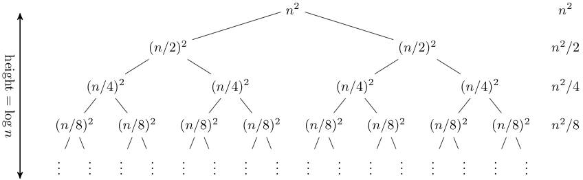

 
The master theorem is kind of a _black box_ method for determining the running time of recursive algorithms. This theorem can be applied to most divide-and-conquer algorithms, including [Karatsuba's multiplication]() and [Strassen's matrix multiplication]().

## Standard Recurrences

Divide-and-conquer algorithms often follow a generic pattern, they solve a problem of size %$n%$ by recursively solving %$a%$ subproblems of size %$n/b%$ and then combining these answers in %$O(n^d)%$ time - with %$a,b,c,d>0%$.

> **Base case:** %$T(n)%$ is at most a constant for all sufficient small %$n%$.
>
>
> **General case:** for larger values of %$n%$,
>
> $$
> T(n) \leq a \cdot T \left( \frac{n}{b} \right) + O(n^d)
> $$
>
> **Parameters:**
> * a = number of recursive calls aka branching factor
> * b = input size shrinkage factor
> * d = exponent in running time of the "combine step"

The **base case** assumes that once the input is so small that no recursive calls are required, the problem can be solved in O(1) time. The **general case** assumes %$a%$ recursive calls, each on a subproblem of size %$\frac{1}{b}%$ times smaller than its input %$n%$ and %$O(n^d)%$ work outside these recursive calls.

The values a, b and d are constants and independent of the input size n. There are constants suppressed in the base case and in the last term, but the master method does not depend on this constants.

## Master Method

The upper bounds can now be calculated easily with the master method.

> If %$T(n)%$ is defined by a standard recurrence, with parameters %$a \geq 1, b > 1, d \geq 0%$ then 
> $$
> T(n) =
> \begin{cases}
> O(n^d \log n),  & \text{if $a=b^d$} \\\\
> O(n^d), & \text{if $a < b^d$} \\\\
> O(n^{\log_b a}),  & \text{if $a>b^d$}
> \end{cases}
> $$

There are also more general versions of the master method that handle a wider family of recurrences. But this simple version is sufficient for almost any divide-and-conquer algorithm.

## Proof of the Master Theorem

The three cases correspond to three different types of the recursion trees. For the proof we explicitly write out all constant factors in the recurrence

> **Base case:** %$T(1) \leq c%$
>
> **General case:** for %$n>1%$,
>
> $$T(n) \leq a \cdot T \left( \frac{n}{b} \right) + cn^d$$

### Recursion Trees

A recursion tree visualizes what happens when a recurrence is iterated. It shows the tree of recursive calls and the amount of work that is done at each call.

The following graph[^RecursionCornell] is an example for a recursion tree of the following recurrence:

$$ T(n) = 2 \cdot T(n/2) + n^2 $$

The rightmost column shows the total work done at each level of the recursion. Since this is a geometric series its sum is %$O(n^2)%$. The depth of the tree does not matter, since the amount of work done on each level is decreasing very fast. The total is only a constant factor more than the root.[^RecursionCornell]

[^RecursionCornell]: https://www.cs.cornell.edu/courses/cs3110/2012sp/lectures/lec20-master/lec20.html

Now the idea is to count the total number of operations performed by the subproblems at the j-th level, and then add up over all levels. At each level are %$a^j%$ different subproblems and each subproblem has the inputsize %$n/b^j%$.

$$ \text{Work at level } j \leq a^j \cdot c \cdot \left[ \frac{n}{b^j} \right]^d $$

- %$a^j%$: Number of subproblems 
- %$c \cdot \left[ \frac{n}{b^j} \right]^d%$: Work per subproblem
- %$\frac{n}{b^j}%$: Input size

By separating the the parts that depend on the level %$j%$ and the parts that do not depend on the level we can rewrite the equation:

$$ \text{Work at level } j \leq cn^d \cdot \left[ \frac{a}{b^d} \right]^j $$

Now we can see the important ratio of %$a/b^d%$ that dictates the case of the master theorem.

Since we have now the work that is done at each level we can sum up, but how many levels are to sum up? We are assuming that %$n%$ is a power of %$b%$ and that the base case is reached when the input size is one, then the number of levels is exactly the number of times we need to divide %$n%$ by %$b%$ to reach 1, also know as %$\text{log}_b n%$. Summing up over all levels leads to the following equation:

$$ \text{Total work} \leq cn^d \cdot \sum_{j=0}^{\text{log}_b n} \left[ \frac{a}{b^d} \right]^j $$

Now we know the total work done at the end of a recursion tree. The next step is to distinguish the three cases.

### The Three Cases

The ratio %$a/b^d%$ is responsible for the three cases. To understand this we have to know what these terms represents:

- %$a%$ represents the **rate of subproblem proliferation (RSP)**
- %$b^d%$ represents the **rate of work shrinkage (RWS)**

The three cases correspond to the three possible outcomes and the three fundamentally different types of recursion trees:

$$ \text{Total work} \leq cn^d \cdot \sum_{j=0}^{\text{log}_b n} \left[ \frac{a}{b^d} \right]^j $$

- RSP = RWS
    - Work performed is the same at very recursion level
- RSP < RWS
    - Work performed is decreasing with the recursion level
- RSP > RWS
    - Work performed is increasing with the recursion level

#### Case 1

When %$a=b^d%$ then the algorithm performs the same amount of work at every level of its recursion tree. It is known how much work is done at the root (level 0) that is to say %$O(n^d%$). 

> With %$O(n^d)%$ work per level, and with %$1+ \log_b n = O(\log n)%$ levels, we should expect a running expect a running time bound of
> $$ O(n^d \log n) $$

For the proof we have to remember the upper bound on the running time of a divide-and-conquer algorithm and with %$a=b^d%$ the right hand side simplifies to:

$$ cn^d \cdot \sum_{j=0}^{\text{log}_b n} \underbrace{\left[ \underbrace{\frac{a}{b^d}}_{=1} \right]^j}_{=1 \text{ for each } j} = cn^d \cdot \underbrace{1+1+...+1}_{1+\log_b n \text{times}}$$

which is %$O(n^d\log n)%$[^logconstinfo].

[^logconstinfo]: Different logarithmic functions differ by a constant factor, there is is no need to specify the base of the algorithm

#### Case 2

When %$a < b^d%$ then the amount of work per level is decreasing with the level. Thus more work is done at level 0 than at any other level. The work done at the root dominates the running time of the algorithm.

> With %$O(n^d)%$ work at the root, this best case scenario would result in an overall running time of
> $$ O(n^d)$$

For the proof we use a geometric series, which is for %$r \neq 1%$:

$$ 1+r+r^2+...+r^k = \frac{1 - r^{k+1}}{1-r}$$

For %$r<1%$ which equals this case with %$a < b^d%$ we can see that the geometric series is dominated by its first term, the first term is 1 and the sum is %$O(1)%$:

$$ 1+r+r^2+...+r^k \leq \frac{1}{1-r} = \text{a constant independent of k}$$

Keeping this in mind we can write the following:

$$ cn^d \cdot \sum_{j=0}^{\text{log}_b n} \left[ \underbrace{\frac{a}{b^d}}_{=r<1} \right]^j = cn^d \cdot \underbrace{\sum_{j=0}^{\text{log}_b n} r^j}_{=O(1)} = \frac{cn^d}{1-r} = O(n^d)$$

The big-O notation suppresses the the constants %$c%$ and %$\frac{1}{1-r}%$

#### Case 3 

When %$a>b^d%$ then the number of subproblems increases even faster than the work-per-subproblem shrinks. The work performed is increasing with the recursion level, with the most work done at the end of the recursion tree.

The best-case scenario would be that the running time is dominated by the work done at the end of the recursion tree. At the end the base case is triggered, so the algorithm performs only %$O(1)%$ operations per end of the recursion tree. The question is now, how many ends does such an recursion tree have?

We know there are %$a^j%$ nodes at each level %$j%$. The last level is %$j = \log_b n%$, so there are %$a^{\log_b n}%$ ends. Thus the best-case scenario would be a running time of %$O(a^{\log_b n})%$. And with the identity %$ a^{\log_b n} = n^{\log_b a}%$ we can summarize:

> With %$O(1)%$ operations at each end (base case) and %$\log_b n%$ ends of the recursion tree, we can expect a running time of
> $$ O(n^{\log_b a}) $$

For this proof we use the geometric series again. For %$r>1%$ which equals this case with %$a > b^d%$ we can see that the geometric series is dominated by its last term, the last term is %$r^k%$ and the sum is %$\frac{r}{r-1}%$ times the last term:

$$ 1+r+r^2+...+r^k = \frac{r^{k+1}-1}{r-1} \leq \frac{r^{k+1}}{r-1} = r^k \cdot \frac{r}{r-1}$$

Keeping this in mind we can write the following:

$$ cn^d \cdot \sum_{j=0}^{\text{log}_b n} \left[ \underbrace{\frac{a}{b^d}}_{=r>1} \right]^j = cn^d \cdot \underbrace{\sum_{j=0}^{\text{log}_b n} r^j}_{=O(r^{\log_b n})} = O(n^d \cdot r^{\log_b n}) = O\left(n^d \cdot \left(\frac{a}{b^d}\right)^{\log_b n}\right) = O(a^{\log_b n}) = O(n^{\log_b a})$$

The second to last step can be done by some cancellations:

$$ (b^{-d})^{\log_b n} = b^{-d \log_b n} = (b^{\log_b n})^{-d} = n^{-d} $$

By this the term %$(1/b^d)^{log_b n}%$ cancels out the %$n^d%$ term and leaves the already known upper bound.