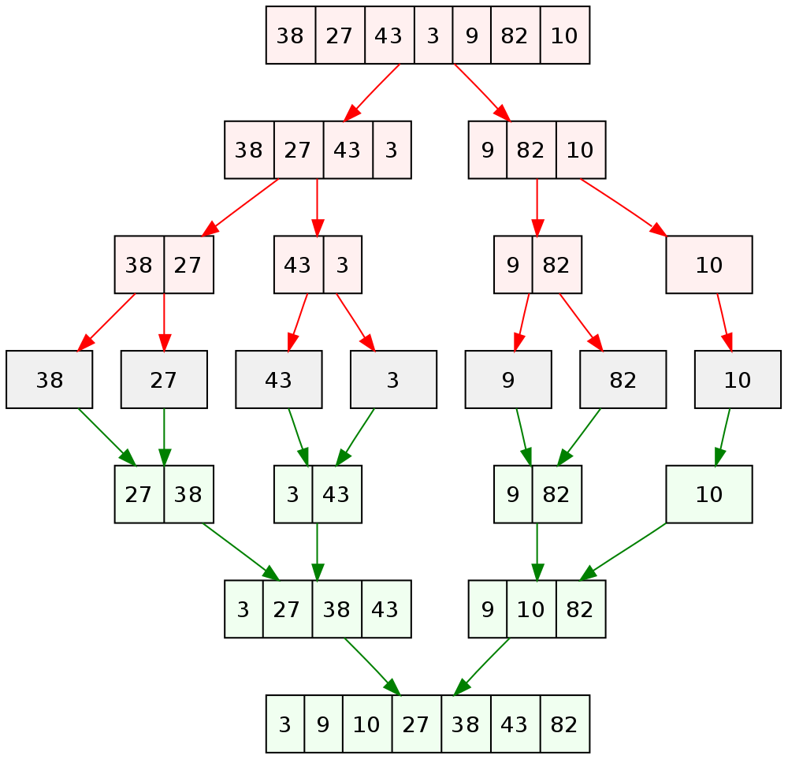

The merge sort algorithm is a quite old algorithm to solve the __sorting problem__ but still widely used and it is a good introduction into __divide & conquer__ algorithms. With divide and conquer the problem to solve will be break down into smaller sub-problems which will solved recursively. The results of these sub-problems will be combined somehow to get a solution for the initial problem.

It is an efficient algorithm and it is an improvement over other more obvious sort algorithms like 

- [Selection sort](),
- [Insertion sort](),
- [Bubble sort]().

## Example

We start with an unsorted array and call recursively the merge sort algorithm. In a first step we split the array in two halves. Then we split each half again, we repeat this until we have each number separated. The second step is to sort and merge until we have a sorted array.



## Explanation

## Complexity / Analysis / Running Time

## Pseudocode

```plaintext
A = 1st sorted array (length=n/2)
B = 2nd sorted array (length=n/2)
C = Output array (length=n)

i = Index of array A
j = Index of array B
k = Index of array C


for k=1 to n
    if A(i) < B(j)
        C(k) = A(i)
        i++
    else [B(j) < A(i)]
        C(k) = B(j)
        j++
end
```

## Implementation

