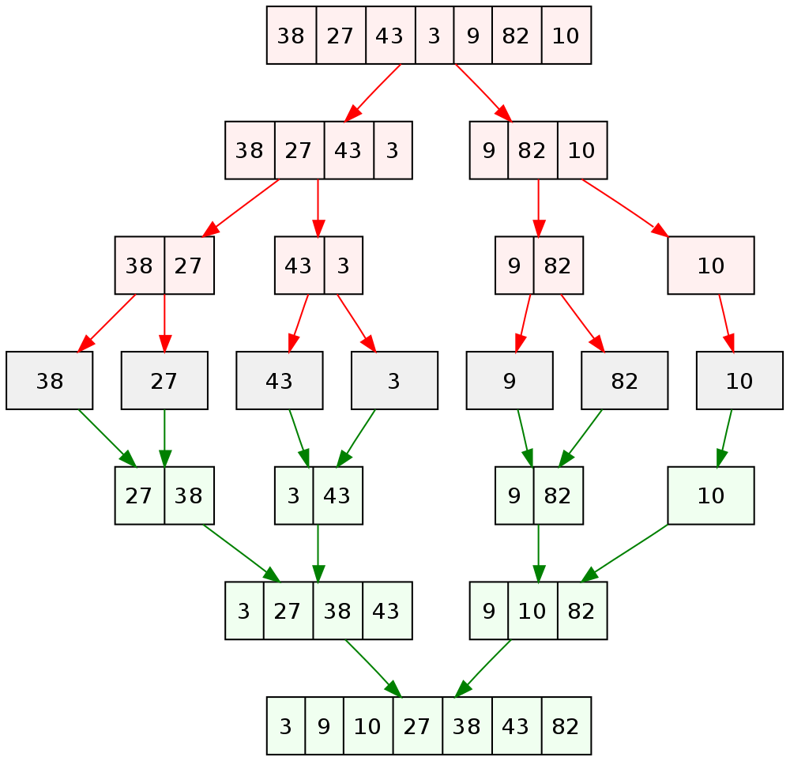

The merge sort algorithm is a quite old algorithm to solve the __sorting problem__ but still widely used and it is a good introduction into __divide & conquer__ algorithms. With divide and conquer the problem to solve will be break down into smaller sub-problems which will solved recursively. The results of these sub-problems will be combined somehow to get a solution for the initial problem.

It is an efficient algorithm and it is an improvement over other more obvious sort algorithms like 

- [Selection sort](),
- [Insertion sort](),
- [Bubble sort]().

## Example

We start with an unsorted array and call recursively the merge sort algorithm. In a first step we split the array in two halves. Then we split each half again, we repeat this until we have each number separated. The second step is to sort and merge until we have a sorted array.



## Explanation

An unsorted array will divided into sub-lists until the base case is reached. The base case is a list of one element and can therefore be considered sorted. The next step is merge these sub-lists until there is only one list remaining.

To merge two sub-lists

- compare the first entries of each sub-list
- the smaller entry goes as first value into the merged list
- then the next entry where the smallest value of the previous comparison was will be compared with the unmoved value of the other sub-list
- the smallest value of this comparison will be moved into the merged list as second value
- repeat this until the sub-lists are empty

```plaintext
Unsorted list                          6,5,3,1,8,7,2,4

Base cases              6     5     3     1     8     7     2     4
Merge 1                   5,6         1,3         7,8         2,4
Merge 2                       1
                          5,6           3
                              1,3
                          5,6
Sorted sub-list                1,3,5,6
Merge 3                                                2
                                                   7,8           4
                                                       2,4
                                                   7,8
Sorted sub-list                1,3,5,6                 2,4,7,8        Compare first values (1 and 2)
Merge 4                                 1
                                 3,5,6                 2,4,7,8        Compare the remaining first values (3 and 2)
                                        1,2
                                 3,5,6                   4,7,8        Compare the remaining first values (3 and 4)
                                        1,2,3
                                   5,6                   4,7,8        Compare the remaining first values (5 and 4)
                                        1,2,3,4
                                   5,6                     7,8        Compare the remaining first values (5 and 7)
                                        1,2,4,5
                                     6                     7,8        Compare the remaining first values (6 and 7)
                                        1,2,3,4,5,6
                                                           7,8        Move remaining values at the the end of the merged list
Sorted list                             1,2,3,4,5,6,7,8
```
## Complexity / Analysis / Running Time

Worst-case performance

$$
O(n \cdot \log n)
$$

## Pseudocode

This pseudocode was found on [Algorithmist](https://algorithmist.com/wiki/Merge_sort).

```plaintext
func mergesort( var a as array )
     if ( n == 1 ) return a

     var l1 as array = a[0] ... a[n/2]
     var l2 as array = a[n/2+1] ... a[n]

     l1 = mergesort( l1 )
     l2 = mergesort( l2 )

     return merge( l1, l2 )
end func

func merge( var a as array, var b as array )
     var c as array

     while ( a and b have elements )
          if ( a[0] > b[0] )
               add b[0] to the end of c
               remove b[0] from b
          else
               add a[0] to the end of c
               remove a[0] from a
     while ( a has elements )
          add a[0] to the end of c
          remove a[0] from a
     while ( b has elements )
          add b[0] to the end of c
          remove b[0] from b
     return c
end func
```

## Implementation

### C++

```cpp
// C++ merge sort implementation

#include <iostream>
#include <vector>
#include <math.h> // Required for std::ceil

// Function to merge two sorted arrays
std::vector<int> merge(std::vector<int> vector1, std::vector<int> vector2)
{
    // Vector to store the result of the merge
    std::vector<int> sorted_list;

    uint i = 0; // Counter for split1
    uint j = 0; // Counter for split2

    // Compare values of both vectors and store in result vector
    while (i < vector1.size() && j < vector2.size())
    {
        if (vector1[i] <= vector2[j])
        {
            sorted_list.push_back(vector1[i]);
            i++;
        }
        else
        {
            sorted_list.push_back(vector2[j]);
            j++;
        }
    }
    while (i < vector1.size()) // Store remaining values in result vector
    {
        sorted_list.push_back(vector1[i]);
        i++;
    }
    while (j < vector2.size()) // Store remaining values in result vector
    {
        sorted_list.push_back(vector2[j]);
        j++;
    }

    return sorted_list;
}

// Function for the merge sort algorithm
std::vector<int> merge_sort(std::vector<int> list)
{
    int length = list.size();

    // Base case
    if (length == 1)
    {
        return list;
    }

    // Recursive case
    int center = std::ceil((float)length / 2);

    std::vector<int> split1(list.begin(), list.begin() + center); // "Left" part of the unsorted list
    std::vector<int> split2(list.begin() + center, list.end());   // "Right" part of the unsorted list

    std::vector<int> sublist1 = merge_sort(split1); // Recursive call
    std::vector<int> sublist2 = merge_sort(split2); // Recursice call
    list = merge(sublist1, sublist2);               // Call merge function

    return list;
}

// Driver code
int main()
{
    std::vector<int> unsorted = {6, 15, 33, 1, 8, 7, 2, 4, 10, 12, 23, 56, 5};

    // Print unsorted list
    std::cout << "Unsorted list: ";
    for (auto i : unsorted)
    {
        std::cout << i << ' ';
    }
    std::cout << std::endl;

    // Call merge-sort function
    std::vector<int> sorted = merge_sort(unsorted);

    // Print sorted list
    std::cout << "Sorted list:   ";
    for (auto i : sorted)
    {
        std::cout << i << ' ';
    }
    std::cout << std::endl;

    return 0;
}
```