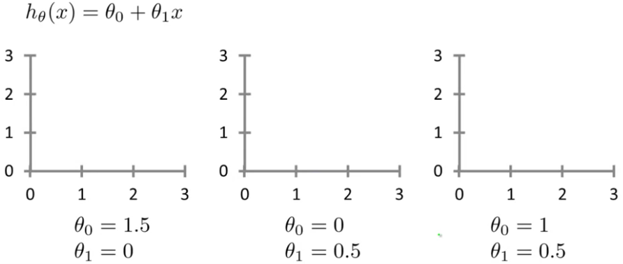
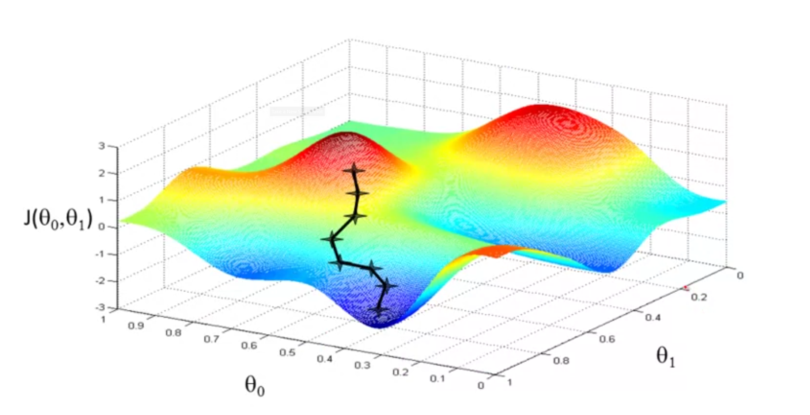

 
## Model Representation

The variable %$x^{(i)}%$ will be used to denote the input variables, aka _input features_, and %$y^{(i)}%$ will denote the _output_ or _target variable_ that we want to predict.

A pair %$(x^{(i)},y^{(i)})%$ is called a training example and the dataset that is used for learning is called a _training set_. This training set is a list of m training examples %$(x^{(i)},y^{(i)});i=1,...,m%$. X denotes the (mathematical) space of input values and Y denotes the space of output values.

The goal is with a given training set, to learn a function %$h:X \rightarrow Y%$ so that %$h(x)%$ is a _good_ predictor for the corresponding value of y. This function h ist called a **hypothesis**.

The whole process looks like this[^coursera_image]

[^coursera_image]: Image is from the [Coursera Machine Learning](https://www.coursera.org/learn/machine-learning) course

In simple words, the training set is feed to the learning algorithm. The learning algorithm should then output the hypothesis. And this hypothesis gets then an input and produces a result. With the house example in mind, the hypothesis gets the size of the house and outputs the estimated value for the corresponding house.

## Hypothesis

The hypothesis in the linear regression model with one variable is 

$$h_\theta(x)=\theta_0 + \theta_1 x$$

 where %$\theta%$ are the parameters. The question now is how to choose these parameters %$\theta_i%$?

Different values for the parameters result in different hypothesis.

## Cost Function

In linear regression a training set is given and we want to get values for the parameters %$\theta_0%$ and %$\theta_1%$ so that the straight line fits the data as good as possible. The idea is to choose the parameters so that %$h_\theta(x)%$ is close to y for the training examples %$x,y%$. This is a minimization problem:

$$
\underset{\theta_0,\theta_1}{\text{minimize}} \qquad \frac{1}{2m}\sum^m_{i=1} \left( h_\theta(x^{(i)}) - y^{(i)} \right)^2
$$

The %$h_\theta(x^{(i)})%$ is the prediction of the hypothesis. The %$y%$ is the actual value. And the goal is to minimize the squared error for the whole training set.

The **cost function** or **squared error function** or **mean squared error** is now:

$$
J(\theta_0,\theta_1) = \frac{1}{2m}\sum^m_{i=1} \left( \hat{y}^{(i)} - y^{(i)} \right)^2 = \frac{1}{2m}\sum^m_{i=1} \left( h_\theta(x^{(i)}) - y^{(i)} \right)^2
$$

And the overall goal is to minimize this cost function and to find the global minimum:

$$
\underset{\theta_0,\theta_1}{\text{minimize}} \quad J(\theta_0,\theta_1)
$$

> The squared error cost function is a reasonable choice and works well for most regression problems. And therefore this function is probably the most commonly used one for regression problems.

## Parameter Learning

### Gradient Descent

[Gradient descent](https://en.wikipedia.org/wiki/Gradient_descent) is a first-order iterative optimization algorithm for finding a local minimum of a differentiable function and will be used to estimate the parameters in the hypothesis function.

In out case we use GD to find the optimal parameters for the hypothesis so that the cost function minimizes. The general procedure is:

- Start with some %$\theta_0,\theta_1%$ for the cost function %$J(\theta_0,\theta_1)%$,
- adjust the parameters %$\theta_0,\theta_1%$ until
- the minimum of the cost function is found.

The following algorithm has to be repeated until convergence is achieved

$$
\theta_j := \theta_j - \alpha \frac{\partial}{\partial \theta_j}J(\theta_0,\theta_1) \quad \forall j
$$

> Assignment:
>
> %$a := b%$ or %$a := a+1%$
>
> Truth association
>
> %$a = b%$ is true, but %$a = a+1%$ can never be true

The learning rate %$\alpha%$ controls how big a step is when taking a step with GD. A large %$\alpha%$ is an aggressive gradient descent procedure and can overshoot the minimum. Another disadvantage of a large learning rate is that the algorithm may fail to converge to a minimum, or even diverge. A small learning rate results in very small steps _downhill_ which results in a very slow algorithm to reach the minimum.

As we see this is a simple partial derivation of the cost function. We derive the cost function for each parameter separately, but it is crucial that all **parameters are updated simultaneously**. This means that we calculate the partial derivative for each parameter and store the result in a temporary variable. After we've done this for all parameters we can update them with the results stored in the temporary variables.

$$
\begin{aligned}
\theta_{temp0} &:= \theta_0 - \alpha \frac{\partial}{\partial \theta_0}J(\theta_0,\theta_1) \\\\
\theta_{temp1} &:= \theta_1 - \alpha \frac{\partial}{\partial \theta_1}J(\theta_0,\theta_1) \\\\
\theta_0 &:= \theta_{temp0} \\\\
\theta_1 &:= \theta_{temp1}
\end{aligned}
$$

When we are at the local or global minimum the partial derivative of the cost function equals zero. This means we are at the local or global optimum. This also means when reaching a local minimum and want to have the global minimum we are stuck. 

In the next graph we see that we find the global minimum of the cost function, but we also see that this approach is susceptible to local minima in general. If we had started slightly more to the right then we would have finished in a local minimum.

Another important point is that GD can converge to a local minimum, even with a fixed learning rate %$\alpha%$. When approaching a local minimum the algorithm will automatically take smaller steps. The reason is that the derivative is getting smaller the nearer the minimum gets and the magnitude of the update for the parameters declines. So, there is no need to decrease the learning rate over time.

### GD for Linear Regression

Now the Gradient Descent algorithm has to be applied on the cost function. The key term is the partial derivative term

$$
\frac{\partial}{\partial \theta_j}J(\theta_0,\theta_1)
$$

What does it look like? First just plug in the definition of the cost function and the hypothesis:

$$
\begin{aligned}
\frac{\partial}{\partial \theta_j}J(\theta_0,\theta_1) &= \frac{\partial}{\partial \theta_j} \left( \frac{1}{2m}\sum^m_{i=1} \left( h_\theta(x^{(i)}) - y^{(i)} \right)^2 \right) \\\\
&= \frac{\partial}{\partial \theta_j} \left( \frac{1}{2m}\sum^m_{i=1} \left( \theta_0 + \theta_1 x^{(i)} - y^{(i)} \right)^2 \right)
\end{aligned}
$$

The partial derivatives for both cases %$\theta_0,\theta_1%$ are then:

$$
\begin{aligned}
\frac{\partial}{\partial \theta_0}J(\theta_0,\theta_1) &= \frac{1}{m}\sum^m_{i=1} \left( h_\theta(x^{(i)}) - y^{(i)} \right) \\\\
\frac{\partial}{\partial \theta_1}J(\theta_0,\theta_1) &= \frac{1}{m}\sum^m_{i=1} \left( h_\theta(x^{(i)}) - y^{(i)} \right) \cdot x^{(i)}
\end{aligned}
$$

These results can now be used in the cost function:

$$
\begin{aligned}
\theta_0 &:= \theta_0 - \alpha \frac{\partial}{\partial \theta_0}J(\theta_0,\theta_1) = \theta_0 - \alpha \frac{1}{m}\sum^m_{i=1} \left( h_\theta(x^{(i)}) - y^{(i)} \right) \\\\
\theta_1 &:= \theta_1 - \alpha \frac{\partial}{\partial \theta_1}J(\theta_0,\theta_1) = \theta_1 - \alpha \frac{1}{m}\sum^m_{i=1} \left( h_\theta(x^{(i)}) - y^{(i)} \right) \cdot x^{(i)}
\end{aligned}
$$

The optimization problem for linear regression has only one global minimum and no local minima, thus this method converges always to the global minimum. Hence the cost function is a convex quadratic function. See also the following contour plot of a quadratic function.

The currently used method is called **batch gradient descent** and means that every example %$(i=1,...m)%$ of the training set is used for the computation step. There are also other methods that use only a subset of the training set.

Gradient descent scales better to larger data sets than the normal equation. The latter one solves numerically the minimum of the cost function without needing an iterative algorithm like gradient descent.
