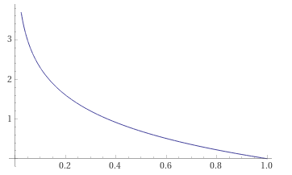
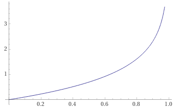

## Classification

In classification problems, we are trying to predict results in a discrete output. An example is to predict whether a tumor is malignant or benign if a patient has a tumor. Another example is if a given email is spam or non-spam.

In these problems the variable to predict is a variable we can is either zero or one, malignant or benign, non-spam or spam. The assignment of the two classes positive and negative to one and zero is arbitrary, but the _rule of thumb_ is that the negative class is conveying the absence of something and the positive class in conveying the presence of something. The assigned values are usually:

$$
y \in
\begin{cases}
0, \quad \text{Negative class (conveying absence of sth.)} \\\\\
1, \quad \text{Positive class (conveying presence of sth.)}
\end{cases}
$$

Classification problems with just two classes are called **binary classification problem**. In multi class classification problems the variable %$y%$ can take many more values than just 0 and 1. 


Linear regression does not work properly in classification problems. It might work in a few cases when we assume that a threshold separates the negative and the positive class. Here is the threshold classifier output %$h_{\theta}(x)=0.5%$:

$$
y =
\begin{cases}
1, \text{ if } h_{\theta}(x) \geq 0.5, \quad \text{Positive class} \\\\\
0, \text{ if } h_{\theta}(x) < 0.5, \quad \text{Negative class}
\end{cases}
$$

But adding more data can blow up this model. Especially when outliers will be added to the dataset. Another problem is that the hypothesis in linear regression can output values that are %$>1%$ or %$<0%$. 

Despite the misleading name **linear regression is a classification algorithm** with the property that the predictions are always between zero and one:

$$
0 \leq h_{\theta}(x) \leq 1
$$

## Hypothesis Representation

Now we need a hypothesis that meets the above mentioned criteria that the classifier output values are in the range between zero and one. To achieve this we will modify the hypothesis for the linear regression:

$$
h_{\theta}(x) = g(\theta^T x)
$$

But what is %$g%$ now? This is the **sigmoid function aka logistic function**, hence the name logistic regression model, and is represented by this formula:

$$
g(z) = \frac{1}{1 + e^{-z}}
$$

The following image shows the sigmoid function:


We can see that the sigmoid function asymptotes to one as %$g(z)%$ approaches infinity and zero as %$g(z)%$ approaches minus infinity. Therefore the requirement that %$0 \leq h_{\theta}(x) \leq 1%$ is satisfied.

An alternative way to write the hypothesis representation is now:

$$
h_{\theta}(x) = \frac{1}{1 + e^{-\theta^T x}}
$$

Now the parameters %$\theta%$ have to be fitted to the data. With a given trainings set and given values for the parameters the hypothesis will output a prediction. But how can the output of the hypothesis interpreted? 

The output can be interpreted as the estimated probability that %$y%$ is equal to one on a new input %$x%$:

$$
h_{\theta}(x) = P(y=1|x;\theta)
$$

This can be read as "probability that %$y=1%$, given %$x%$ and parameterized by %$\theta%$". We can also write:

$$
h_{\theta}(x) = P(y=1|x;\theta)
$$

Now, this can be read as "probability that %$y=0%$, given %$x%$ and parameterized by %$\theta%$". Since this is a classification task the value for y has to be either zero or one. The probability of both cases sums up to one and therefore we can write the following equation:

$$
P(y=0|x;\theta) + P(y=1|x;\theta) = 1
$$


## Decision Boundary

To get the discrete classification, we can translate the output of the hypothesis as follows and as we have done it before with a different notation:

$$
\begin{align}
h_{\theta}(x) = g(\theta^T x) &\geq 0.5 \rightarrow y=1 \\\\
h_{\theta}(x) &< 0.5 \rightarrow y=0
\end{align}
$$

Now we have to understand when %$h_{\theta}%$ is smaller or bigger 0.5. When looking at the graph of the logistic function we see that %$g(z) \geq 0.5%$ when %$z \geq 0%$. And since %$z = \theta^T x%$ we can conclude:

$$
\begin{align}
\theta^T x &\geq 0 \Rightarrow y=1 \\\\
\theta^T x &< 0 \Rightarrow y=0
\end{align}
$$

The **decision boundary** is the line that separates the area where y = 0 and where y = 1. It is created by our hypothesis function and by solving the above equation we get the boundary. To explain the calculation we use the following hypothesis:

$$
h_{\theta}(x) = g(\theta^T x) = g(\theta_0 + \theta_1 x_1 + \theta_2 x_2) 
$$

And we use the following values for the parameters and x-vector:

$$
\theta = \begin{bmatrix}
    -3 \\\\
    1 \\\\
    1
\end{bmatrix}
\qquad
x = \begin{bmatrix}
    1 \\\\
    x_1 \\\\
    x_2
\end{bmatrix}
$$

And now we can write the following inequalities: 

$$
\begin{aligned}
y=1&: \quad  \theta^T x = -3 + x_1 + x_2 \geq 0 \\\\
y=0&: \quad  \theta^T x = -3 + x_1 + x_2 < 0 \\\\
\end{aligned}
$$

The decision boundary can now drawn with the following equation:

$$
-3 + x_1 + x_2 = 0 \Rightarrow x_1 + x_2 =-3
$$

The result is a straight line and corresponds to the set of points where %$h_{\theta}(x)%$ is exactly 0.5 and separates the regions where the hypothesis predicts %$y=1%$ and %$y=0%$. It is important to understand that this boundary is a property of the hypothesis and not a property of the data set. Later we will determine and optimize the parameters by using test data so that the hypothesis will create a "good" decision boundary for a data set. But as long as we have the parameters we the decision boundary is completely defined.

Until now we calculated a linear decision boundary but there are also **non-linear decision boundaries**. Let's assume the following hypothesis:

$$
h_{\theta}(x) = g(\theta^T x) = g(\theta_0 + \theta_1 x_1 + \theta_2 x_2 + \theta_3 x^2_1 + \theta_4 x^2_2) 
$$

And by some magic we get the following five parameters:

$$
\theta = \begin{bmatrix}
    -1 \\\\
    0 \\\\
    0 \\\\
    1 \\\\
    1
\end{bmatrix}
$$

And now we can - as above - write the following inequalities: 

$$
\begin{aligned}
y=1&: \quad  \theta^T x = -1 + x^2_1 + x^2_2 \geq 0 \\\\
y=0&: \quad  \theta^T x = -1 + x^2_1 + x^2_2 < 0 \\\\
\end{aligned}
$$

The decision boundary is now represented by the following equation:

$$
x^2_1 + x^2_2 = 1
$$

And this is the equation for a circle centered around the origin. And everything outside the circle is in the positive class and everything inside the circle is in the negative class.

> By adding more complex terms to the features it is possible to get more complex decision boundaries.

An example for a more complex hypothesis is the following one:

$$
h_{\theta}(x) = g(\theta_0 + \theta_1 x_1 + \theta_2 x_2 + \theta_3 x^2_1 + \theta_4 x_1 x^2_2 + \theta_5 x^2_2 x^3_1 + ...) 
$$

## Logistic Regression Model

Now we will fit the parameters of %$\theta%$. The following is the supervised learning problem of fitting the logistic regression model. We use a training set of m training examples

$$
\\{ (x^{(1)}, y^{(1)}), (x^{(2)}, y^{(2)}), ..., (x^{(m)}, y^{(m)}) \\}
$$

and each example is represented by a %$\mathbb{R}^{n+1}%$ dimensional feature vector

$$
x \in \begin{bmatrix}
    x_0 \\\\
    x_1 \\\\
    \vdots \\\\
    x_n
\end{bmatrix}
\qquad
x_0=1, \quad y \in \\{ 0,1 \\}
$$

And the hypothesis is the already known one:

$$
h_{\theta}(x) = \frac{1}{1+ e^{-\theta^T x}}
$$

The question is no how to fit the parameters %$\theta%$? How does look like the cost function? 

### Cost Function

The cost function that was used in the linear regression model can not be used because the logistic function will cause the output be wavy, since the function won't be convex.

The linear regression uses the following cost function:

$$
J(\theta) = \frac{1}{m} \sum^m_{i=1} \frac{1}{2} \left( h_{\theta}(x^{(i)}) - y^{(i)} \right)^2 = \frac{1}{m} \sum^m_{i=1} Cost \left( h_{\theta}(x^{(i)}),y^{(i)} \right)
$$

If this particular cost function is used with the hypothesis %$h_{\theta}(x) = \frac{1}{1+ e^{-\theta^T x}}%$ then this results in a non-convex function of the parameter's data. This means when using gradient descent then it is not guaranteed to converge to the global minimum.

So we need another cost function that guarantees to converge to a global minimum when applying gradient descent


$$
Cost(h_{\theta}(x),y) =
\begin{cases}
\begin{aligned}
-\log(h_{\theta}(x)) \quad &\text{if} \quad y=1\\\\\
-\log(1 - h_{\theta}(x)) \quad &\text{if} \quad y=0
\end{aligned}
\end{cases}
$$

This cost function has some desirable properties. To explain them we plot the first case. The axis are %$J(\theta) \text{ vs } h_{\theta}(x)%$.



We see that %$Cost=0%$ if %$y=1%$ and %$h_{\theta}(x)=1%$. This means that the hypothesis predicts correctly %$y=1%$ and therefore there is no penalty for the learning algorithm. But the costs explode if %$y=1%$ and %$h_{\theta}(x)=0%$. In this case the prediction is not correct and the learning algorithm is penalized with costs that goes to infinity %$(Cost \rightarrow \infty)%$.

Now we look at the second case: 



The %$Cost=0%$ if %$y=0%$ and %$h_{\theta}(x)=0%$. The prediction of the hypothesis is correct. But the costs explode if %$y=0%$ and %$h_{\theta}(x)=1%$. In this case the prediction is not correct and the cost function approaches infinity %$(Cost \rightarrow \infty)%$.

Roundup of the three cases: 

$$
Cost(h_{\theta}(x),y) =
\begin{cases}
\begin{aligned}
0 \quad &\text{if} \quad h_{\theta}(x)=y \\\\\
\rightarrow \infty \quad &\text{if} \quad y=0 \land h_{\theta}(x) \rightarrow 1 \\\\
\rightarrow \infty \quad &\text{if} \quad y=1 \land h_{\theta}(x) \rightarrow 0
\end{aligned}
\end{cases}
$$

### Simplified Cost Function

Now we will simplify the cost function so that the two lines will be compressed into one equation.

$$
Cost(h_{\theta}(x),y) = -y \log(h_{\theta}(x)) - (1-y) \log (1-h_{\theta}(x))
$$

With %$y=0%$ the first term will be zero and with %$y=1%$ the second term will be zero. So the term that represents the other case will not affect the result.

The simplified cost function is now:

$$
\begin{aligned}
J(\theta) &= \frac{1}{m} \sum^m_{i=1} Cost \left( h_{\theta}(x^{(i)}),y^{(i)} \right) \\\\
&= -\frac{1}{m} \left[ \sum^m_{i=1} y^{(i)} \log(h_{\theta}(x^{(i)})) - (1-y^{(i)}) \log (1-h_{\theta}(x^{(i)})) \right]
\end{aligned}
$$

The vectorized version is:

$$
\begin{aligned}
 h &= g(X \theta) \\\\
J(\theta) &= \frac{1}{m} \cdot -y^T \log(h) - (1-y)^T \log(1-h)
\end{aligned}
$$

### Gradient Descent

By minimizing the cost function we get a set of parameters %$\theta%$:

$$
\underset{\theta}{\text{minimize}} \quad J(\theta)
$$

The computed %$\theta%$ and a new given set of features %$x%$ can make predictions then:

$$
h_{\theta}(x) = \frac{1}{1+e^{-\theta^T x}}
$$

And the hypothesis is as already known the probability that %$y=1%$: %$P(y=1|x;\theta)%$ 

But how to minimize the cost function? Basically, the following algorithm has to be repeated simultaneously for every %$\theta_j%$ until convergence is achieved:

$$
\begin{aligned}
\theta_j :&= \theta_j - \alpha \frac{\partial}{\partial \theta_j}J(\theta) \\\\
&= \theta_j - \alpha \frac{1}{m}\sum^m_{i=1} \left( h_\theta(x^{(i)}) - y^{(i)} \right) \cdot x_j^{(i)}
\end{aligned}
$$

The vectorized version is:

$$
\theta := \theta - \alpha \frac{1}{m} X^T (g(X \theta) - y)
$$

We immediately see that this equations look identical to [linear regression](). In fact only the definition of the hypothesis has changed, everything else remains unchanged.

### Optimization Algorithms

Aside from gradient descent there are some more advanced optimization algorithms that scale better to very large machine learning problems. Possible optimization algorithms are:

- [Gradient descent](https://en.wikipedia.org/wiki/Gradient_descent)
- [Conjugate gradient](https://en.wikipedia.org/wiki/Conjugate_gradient_method)
- [BFGS](https://en.wikipedia.org/wiki/Broyden–Fletcher–Goldfarb–Shanno_algorithm)
- [L-BFGS](https://en.wikipedia.org/wiki/Limited-memory_BFGS)

The advantages of the last three algorithms are that there is no need to pick %$\alpha%$ manually and they are often faster than gradient descent. But a drawback is the complexity of these algorithms.

To use any of the algorithms we need to provide them %$J(\theta)%$ and %$\frac{\partial}{\partial \theta_j} J(\theta)%$. To achieve this we could write a function that returns both of these:

```matlab
function [jVal, gradient] = costFunction(theta)
  jVal = [...code to compute J(theta)...];
  gradient = [...code to compute derivative of J(theta)...];
end
```

And now we use an optimization algorithm, for example the [`fminunc()`](https://www.mathworks.com/help/optim/ug/fminunc.html) function along with the [`optimset()`](https://www.mathworks.com/help/matlab/ref/optimset.html) function to get the desired results. The latter function creates an optimization structure (object) we send to the `fminunc()` function. The code might look like in the following example.

#### Matlab Example

Parameters:

$$
\theta = \begin{bmatrix}
    \theta_1 \\\\
    \theta_2 
\end{bmatrix}
$$

Cost function:

$$
J(\theta) = (\theta_1 - 5)^2 + (\theta_2 - 5)^2
$$

To get the minimum of the cost function we have to compute the partial derivatives:

$$
\begin{aligned}
\frac{\partial}{\partial \theta_1} J(\theta) &= 2 ( \theta_1 - 5 ) \\\\
\frac{\partial}{\partial \theta_2} J(\theta) &= 2 ( \theta_2 - 5 )
\end{aligned}
$$

And now we put the cost function and the partial derivatives into the Matlab function:

```matlab
function [jVal, gradient] = costFunction(theta)
  jVal = (theta(1)-5)^2 + (theta(2)-5)^2;
  gradient(1) = 2*(theta(1)-5);
  gradient(2) = 2*(theta(2)-5);
end
```

The last step is to use an optimization function, either gradient descent or any other. In this example we use the above mentioned `fminunc()` function in Matlab:

```matlab
options = optimset('GradObj', 'on', 'MaxIter', 100);
initialTheta = zeros(2,1);
    [optTheta, functionVal, exitFlag] = fminunc(@costFunction, initialTheta, options);
```

The result will be:

$$
\theta = \begin{bmatrix}
    5 \\\\
    5
\end{bmatrix}
$$

## Multiclass Classification

In multiclass classification problem we have not just two categories %$y \in \\{\ 0,1 \\}%$, instead we can have more categories %$y \in \\{\ 0,1,...,n \\}%$. The following algorithm to solve this kind of problem is called **one-vs-all classification algorithm**.

The idea is to divide the problem into %$n+1%$ binary classification problems, since %$y \in \\{\ 0,1,...,n \\}%$. And for each classification problem the prediction that %$y%$ is member of one of the classes will be computed:

$$
\begin{aligned}
h_{\theta}^{(0)} &= P(y=0|x;\theta) \\\\
h_{\theta}^{(1)} &= P(y=1|x;\theta) \\\\
\vdots & \\\\
h_{\theta}^{(n)} &= P(y=n|x;\theta)
\end{aligned}
$$

The basic principle is choosing one class and putting all the others into  a single second class. This will be done repeatedly, applying logistic regression to each case, and then use the hypothesis that returned the highest value as the prediction.

$$
\text{prediction} = \underset{i}{\text{max}} \quad h_{\theta}^{(i)}(x)
$$

To summarize: We train a logistic regression classifier %$h_{\theta}^{(i)}(x)%$ for each class %$i%$ to predict the probability that %$y=i%$. And to make a prediction on a new input %$x%$, we pick the class %$i%$ that maximizes %$\underset{i}{\text{max}} \quad h_{\theta}^{(i)}(x)%$.

## Overfitting